# Production-Grade AWS CodePipeline with Terraform

This project provides all the necessary Infrastructure as Code (IaC) to provision a complete, production-grade CI/CD pipeline on AWS using Terraform. The pipeline is designed for high availability and scalability, automatically deploying code from a GitHub repository to a fleet of EC2 instances managed by an Auto Scaling Group behind a Load Balancer.

## Architecture

The provisioned infrastructure follows a modern, event-driven CI/CD pattern.

***Note:** The following diagram is written in Mermaid syntax. It will render as a visual flowchart in most modern Markdown viewers, such as on GitHub.*

```mermaid
flowchart TD
  %% Direction top to bottom
  direction TB

  %% Developer
  subgraph DEV["👨‍💻 Developer"]
    A1["💻 Push Code to GitHub"]
  end

  %% AWS Infra
  subgraph AWS["☁️ AWS Infrastructure via Terraform"]
    C1["📦 S3 Bucket\n(Artifact Storage)"]
    C2["🏗️ CodeBuild\n(Build & Test)"]
    C3["🚀 CodeDeploy\n(EC2 Deployment)"]
    C4["🔁 CodePipeline\n(CI/CD Orchestrator)"]
    C5["🔐 IAM Roles & Policies"]
  end

  %% Flow connections
  A1 --> C4

  C4 --> C1
  C4 --> C2
  C4 --> C3
  C4 --> C5
```




### Workflow Steps:
1.  **Trigger:** A developer pushes a new commit to the specified branch on GitHub.
2.  **Source Stage:** AWS CodePipeline detects the new commit via a secure CodeStar Connection and downloads the source code into a private S3 artifact bucket.
3.  **Build Stage:** CodePipeline triggers an AWS CodeBuild job. CodeBuild reads the source code from the S3 bucket, performs any necessary build steps (in this case, none are needed for a static site), and packages the final artifacts (including the `appspec.yml` file) for deployment.
4.  **Deploy Stage:** CodePipeline triggers an AWS CodeDeploy job. CodeDeploy reads the build artifacts and performs a safe, rolling deployment to the instances managed by the Auto Scaling Group, using the Application Load Balancer to ensure zero downtime.
5.  **Result:** The new version of the website is live and accessible to users via the Load Balancer's public URL.

---

## File Structure

The project is organized into logical Terraform files for maintainability.

```
.
├── main.tf                 # Main Terraform config, provider, and locals
├── variables.tf            # All input variables for the project
├── terraform.tfvars        # User-specific values for variables (created by user)
├── network.tf              # Defines the Load Balancer and Target Group
├── ec2.tf                  # Defines the Launch Template and Auto Scaling Group
├── codedeploy.tf           # Defines the CodeDeploy Application and Deployment Group
├── codepipeline.tf         # Defines the core AWS CodePipeline resource
├── codebuild.tf            # Defines the AWS CodeBuild project
├── s3.tf                   # Defines the S3 bucket for pipeline artifacts
├── iam.tf                  # Defines all necessary IAM Roles and Policies
├── outputs.tf              # Defines the stack outputs (e.g., website URL)
└── test/
└── codepipeline_test.go    # The Terratest infrastructure test suite
```

---

## Setup and Deployment

Follow these steps to deploy the infrastructure.

### Prerequisites
* An AWS account with configured credentials.
* [Terraform CLI](https://learn.hashicorp.com/tutorials/terraform/install-cli) installed.
* A GitHub repository containing your website files, including `appspec.yml` and `scripts/start_server.sh`.

### 1. Configure Your Variables
Create a file named `terraform.tfvars` in the root of the project and provide values for the required variables.

**Example `terraform.tfvars`:**

The AWS region where resources will be created.
aws_region = "ap-south-1"

A unique name for your project.
project_name = "my-portfolio"

Your GitHub username or organization name.
github_repo_owner = "your-github-username"

The name of your GitHub repository.
github_repo_name = "your-website-repo"


### 2. Deploy the Infrastructure
Run the following commands from the root of the project directory:


Download the necessary provider plugins
terraform init

Create all the AWS resources
terraform apply


When prompted, review the plan and type `yes` to confirm.

### 3. Authorize the GitHub Connection
This is a one-time manual step required for security.
1.  Navigate to the **AWS CodePipeline** console.
2.  Go to **Settings > Connections**.
3.  Find the connection with a `Pending` status.
4.  Click the connection name, then click **Update pending connection** and follow the prompts to authorize it in your GitHub account.

Once the connection is `Available`, the pipeline will automatically run and deploy your website. You can find the public URL in the `website_url` output from the `terraform apply` command.

---

## Infrastructure Testing with Terratest

This project includes an automated test suite to validate the infrastructure.

### Prerequisites
* [Go programming language](https://go.dev/doc/install) installed.

### How to Run the Tests
The tests should be run from a **separate, clean copy** of the project folder to avoid interfering with your live infrastructure's state file.

1.  **Create a clean test directory:**
    ```
    # Create a new folder
    mkdir C:\temp-test
    
    # Copy the necessary files
    xcopy C:\terraform-codepipeline C:\temp-test /E /I
    ```

2.  **Navigate to the test directory:**
    ```
    cd C:\temp-test\test
    ```

3.  **Initialize Go and download dependencies:**
    ```
    go mod init terraform-codepipeline/test
    go mod tidy
    ```

4.  **Execute the test:**
    This command will build a temporary copy of the infrastructure, run validations, and automatically destroy it.
    ```
    go test -v -timeout 30m
    ```

A `--- PASS:` message indicates that your Terraform code is valid and creates the infrastructure as expected.
